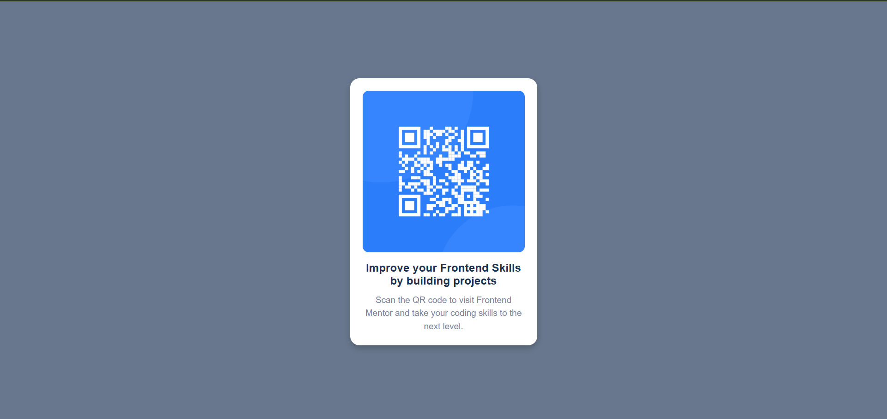

# Frontend Mentor - QR Code Component Solution  

This is my solution to the [QR Code Component Challenge on Frontend Mentor](https://www.frontendmentor.io/challenges/qr-code-component-iux_sIO_H). This challenge helped me practice **HTML**, **CSS**, and responsive design by creating a simple yet visually appealing QR code component.  

## Table of Contents  

- [Overview](#overview)  
  - [Screenshot](#screenshot)  
  - [Links](#links)  
- [My Process](#my-process)  
  - [Built With](#built-with)  
  - [What I Learned](#what-i-learned)  
  - [Continued Development](#continued-development)  
  - [Useful Resources](#useful-resources)  
- [Author](#author)  

## Overview  

### Screenshot  

  

### Links  

- **Solution URL:** [Add your solution URL here](https://your-solution-url.com)  
- **Live Site URL:** [Add your live site URL here](https://your-live-site-url.com)  

## My Process  

### Built With  

- **Semantic HTML5** markup  
- **CSS3** custom properties  
- **Flexbox** for layout  
- **Mobile-first workflow**  

### What I Learned  

During this challenge, I improved my understanding of **CSS Flexbox** and how to style a **responsive card component**. Some key learnings include:  

- Using `display: flex;` for centering the container  
- Applying `border-radius` for smooth rounded corners  
- Adding `box-shadow` for a clean and modern look  

Here’s a small code snippet of my container styling:  

```css
.container {
  display: flex;
  flex-direction: column;
  align-items: center;
  text-align: center;
  max-width: 300px;
  background-color: hsl(0, 0%, 100%);
  border-radius: 15px;
  padding: 20px;
  box-shadow: 0px 4px 10px rgba(0, 0, 0, 0.2);
}
```  

### Continued Development  

Moving forward, I want to:  

- Improve my **CSS Grid** and **Flexbox** skills  
- Work on **more responsive designs** for different screen sizes  
- Learn **SCSS** for better styling management  

### Useful Resources  

- [CSS Tricks - A Complete Guide to Flexbox](https://css-tricks.com/snippets/css/a-guide-to-flexbox/) – Helped me with centering and aligning elements properly.  
- [MDN Web Docs - CSS Box Model](https://developer.mozilla.org/en-US/docs/Web/CSS/box_model) – Helped me understand spacing, padding, and margins better.  

## Author  

- **Frontend Mentor Profile:** [@yourusername](https://www.frontendmentor.io/profile/yourusername)  
- **LinkedIn:** [Your LinkedIn Profile](https://www.linkedin.com/in/yourname)  
- **GitHub:** [Your GitHub Profile](https://github.com/yourusername)  

